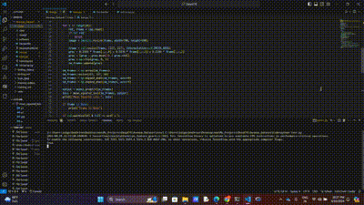

# DeepEYE: Anomaly Detection in Video Surveillance

### Welcome to the **DeepEYE: Anomaly Detection in Video Surveillance** repository 

In this innovative project, we push the boundaries of deep neural networks by extending them to three dimensions for video analysis. We capture both spatial and temporal features from video feeds by introducing a spatio-temporal autoencoder based on a 3D convolution network. The encoder extracts intricate details, while the decoder reconstructs frames. Abnormal events are pinpointed by measuring the reconstruction loss via Euclidean distance between original and reconstructed batches. This approach revolutionizes video surveillance, enabling accurate anomaly detection by harnessing the power of deep learning in understanding dynamic visual data.


## Project Structure
```
├── Data 
│   ├──Train
│   ├── Test
├── app
│   ├── app.py
│   ├── results
│       ├── json_frames.json
├── Dockerfile
├── README.md
├── model
│   ├── saved_model.keras
├── vid2array.py
├── training.npy
├── train.py
├── test.py
├── requirements.txt
├── results 
```

### Dataset
- **Train**: This directory contains training data for building anomaly detection deep learning models.
- **Test**: This directory contains test data for evaluating the performance of the anomaly detection models.
You can download the dataset from here - <a href = "http://www.cse.cuhk.edu.hk/leojia/projects/detectabnormal/dataset.html">Download</a>

### File Description
- **vid2array.py**: This Python script implements the data preparation.
- **train.py**: This script implements the abnormal event detection mechanism and trains the model on the data.
- **test.py**: This script tests the anomaly detection model.
- **training.npy**: Numpy file containing preprocessed training data.
- **model.keras**: Trained anomaly detection model saved in keras format.
- **app.py**: A real-time application showcasing the anomaly detection output on the given video.
- **requirements.txt**: List of Python dependencies required to run the code.
- **Dockerfile**: It facilitates containerized application deployment, ensuring seamless setup and execution across different environments.

## How to Use
1. Clone this repository to your local machine:

```bash
git clone https://github.com/jaigane6387/DeepEYE_Video_Surviellience.git
```
2. Install the required dependencies:
```bash
pip install -r requirements.txt
```
### Model Training
Now, download the data from the given source/link and structure it to train and test directories.

3.  Prepare the data by converting all the videos to frames:
```bash
python vid2array.py
```
4. Train the anomaly detection model using the provided training data
```bash
python train.py
```
### Inference
5. Test the trained model on test data:
```bash
python test.py
```

## Application setup
If you want to directly view the working application, first we need to go through a couple of steps to set up and run the live application.
1. You need to install the Docker application and set up it accordingly. For reference, you can refer to this <a href="https://www.youtube.com/watch?v=Xuyt5U83qqA&list=PLZoTAELRMXVNKtpy0U_Mx9N26w8n0hIbs&index=4">video</a>

2. Navigate to Repository
Change your directory to the cloned repository:
```bash
cd <repository-directory>
```
3. Build a Docker Image
Build the Docker image using the provided Dockerfile
```bash
docker build -t myapp .
```
4. Run Docker Container
Run a Docker container from the built image:
```bash
docker run -it --rm -p 5000:5000 myapp
```

## Output

<!-- Example GIF -->
<p align="center">
  
</p>
<!-- Example Image -->


## Tech Stack

<div align="center">
    
    
    
</div>

These technologies are the backbone of this project, providing powerful tools for Data Manipulation, Deep Learning, and Computer Vision tasks.

## Bug Reports and Feature Requests

If you encounter any issues with the code or have suggestions for new features, please don't hesitate to [open an issue](https://github.com/yourusername/Video-Surveillance-Anomaly-Event-Detection/issues). Your feedback is highly appreciated and will help improve this project for everyone.

### Social
Connect with me on social media platforms to stay updated on this project and more!

- Blogs: https://dataaspirant.com/author/jaiganesh-nagidi/
- LinkedIn: https://www.linkedin.com/in/jai-ganesh-nagidi/
- Kaggle: https://www.kaggle.com/jaiganeshnagidi

